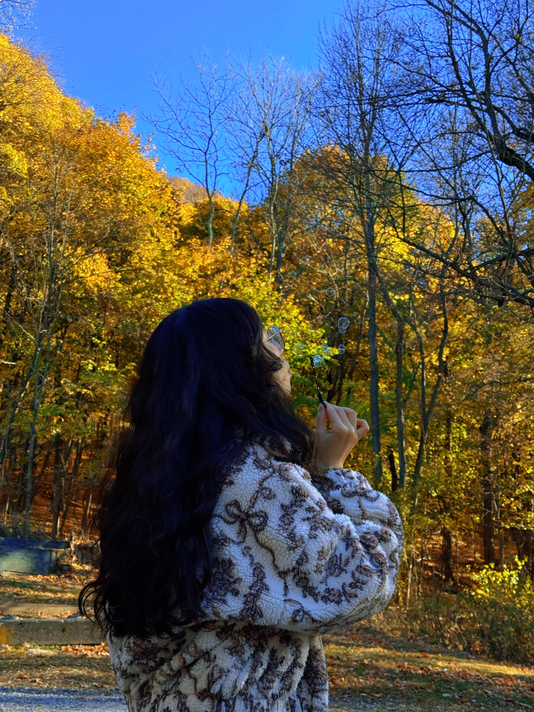

Hi! I’m Yuanyuan Zhang, a graduate student at Columbia University Mailman School of Public Health (Biostatistics). When I’m not study or working on projects, I enjoy exploring the city, trying new desserts, and finding cozy place to read.

&nbsp;
  

Hobbies & Interests
------------------------------------------------------------
🌍 Exploring new neighborhoods in NYC
🍰 Desserts — macarons, cakes, and anything seasonal
📚 Reading philosophy & psychology books, especially Taoism and mindfulness topics

Here are some picture about me.
  

  
